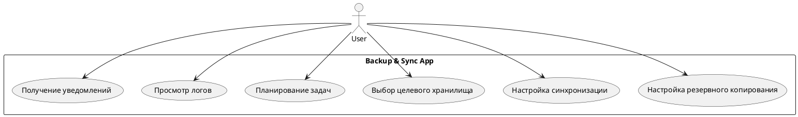
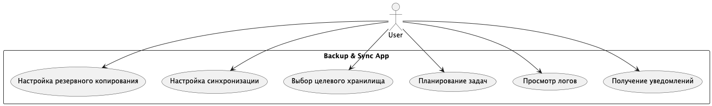
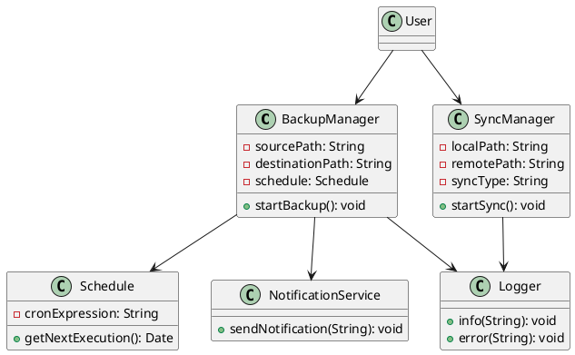
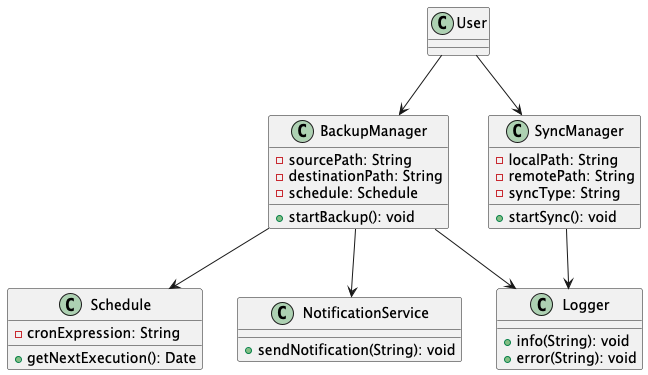
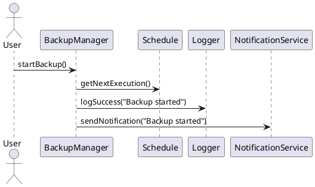
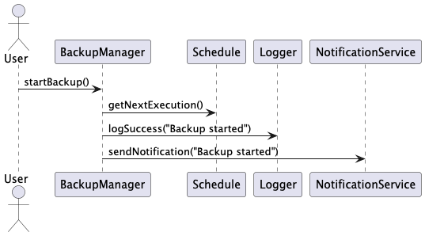
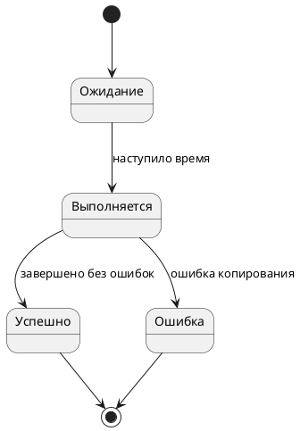
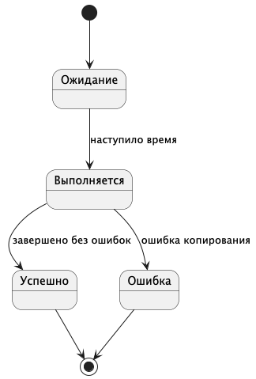
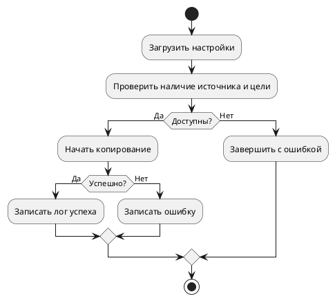
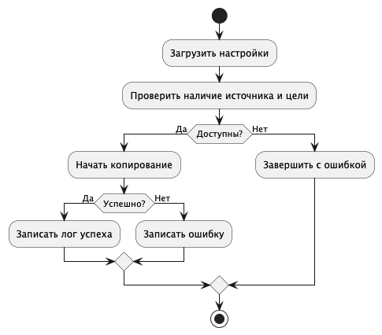

# README

Репозиторий с UML диаграммами раскрывающими функциональность продукта для ВКР

---

## 1. Use Case Diagram

---

## 2. Class Diagram

---

## 3. Sequence Diagram

---

## 4. State Diagram

---

## 5. Activity Diagram

---

# 🎥 Скринкаст
[Перейти к скринкасту](https://drive.google.com/file/d/1w4OBa3zazzeo4e07IvCDJM6Ja9Oc6dq9/view?usp=share_link)
